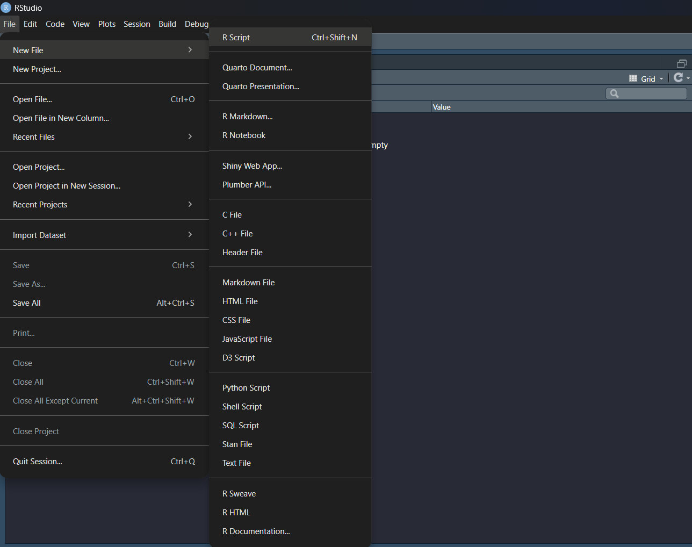
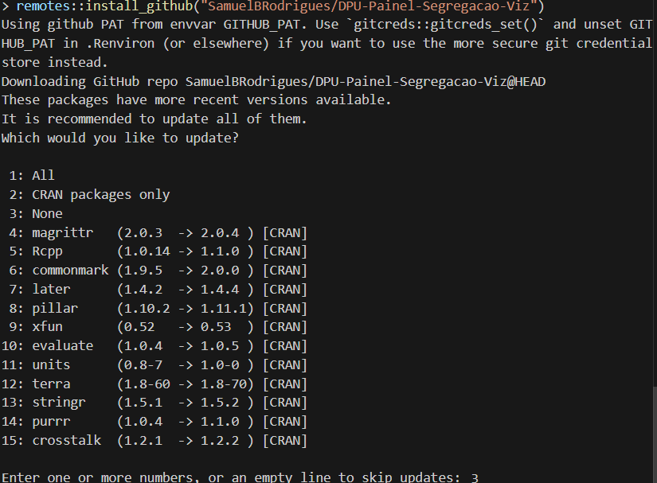

```{r, include = FALSE}
knitr::opts_chunk$set(
  collapse = TRUE,
  comment = "#>"
)
```

O presente documento é um passo a passo de como visualizar o Painel localmente na máquina, sem precisa hospedá-lo na web (ShinyApps ou Site).

Primeiramente é preciso baixar o R e o RStudio:

-   [R para windows](https://cran.rstudio.com/bin/windows/base/R-4.5.1-win.exe)

-   [R para MacOS](https://cran.rstudio.com/bin/macosx/big-sur-arm64/base/R-4.5.1-arm64.pkg)

-   [RStudio para Windows](https://download1.rstudio.org/electron/windows/RStudio-2025.09.1-401.exe)

-   [Rstudio para MacOS](https://download1.rstudio.org/electron/macos/RStudio-2025.09.1-401.dmg)

Uma vez ambos baixados, é necessário executar o RStudio e abri um novo script. Para abrir um novo script clicamos em **File**→ **New File → R Script** ou apertamos **Ctrl + Shift + N.**

```{r, echo=FALSE, out.width="80%", fig.cap="Abrindo um Script no RStudio"}
    
```

Uma vez aberto o script, precisamos instalar os pacotes básicos que compõem o Painel. (Copiar e colar o script abaixo no RStudio).

``` r
# Instalando os pacotes que compõem o Painel
install.packages(c("shiny", "bslib", "DT", "tidyverse", "leaflet", "remotes"))

# Baixando a Biblioteca que gera o Painel
remotes::install_github("SamuelBRodrigues/DPU-Painel-Segregacao-Viz")
```

Obs.: Quando estiver instalando esse pacote aparecerá uma mensagem no **Console**:

*Enter one or more numbers, or an empty line to skip updates:*

O seu input deverá ser: ***3*** e apertar **ENTER**

```{r, echo=FALSE, out.width="80%", fig.cap="Console ao instalar o Pacote de Visualização"}

```

Uma vez esses pacotes instalados, estamos prontos para Visualizar o Painel localmente:

``` r
# Chamando as bibliotecas
library(shiny)
library(bslib)
library(DT)
library(tidyverse)
library(leaflet)
library(dpupsviz)

run_app()
```